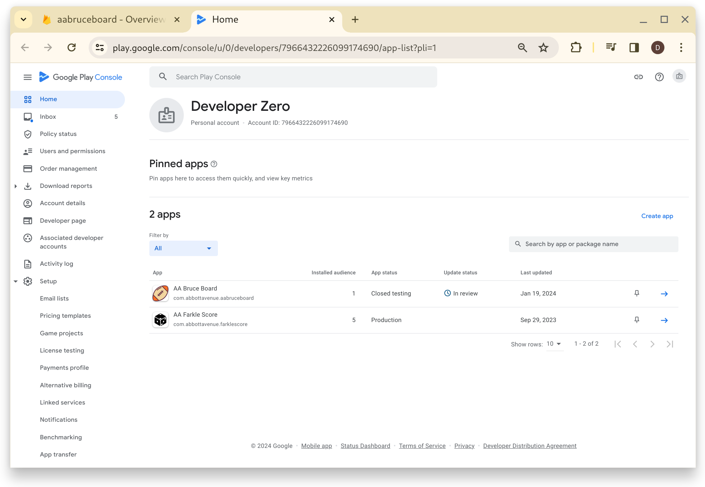

# Bruce Board Build Setup
## Add Firestore 
The following page provides details on setting up firestore for the application.
[Firestore Configure](https://firebase.google.com/docs/flutter/setup?platform=ioskhttps://firebase.google.com/docs/flutter/setup?platform=ios)


## Firebase Structrue 

Messages Process
Sender has "Create" access to /Player/{UID-Receiver}/Message/{UID-Sender}/Incoming/{Send-Msg-ID}

Sender writes message to : 
/Player/{UID-Receiver}/Message/{UID-Sender}/Incoming/{Send-Msg-ID}

Receiver reads message and processes it, copy to Processed and deleting from Request
/Player/{UID-Receiver}/Message/{UID-Sender}/Processed/{Send-Msg-ID}

Receiver send Response back to Sender
/Player/{UID-Sender}/Message/{UID-Receiver}/Response/{Send-Msg-ID}

Message Class: 
MSID = Message ID, Unique to Sender
Type = {Community Join Request-M001, Square Select Request-M002}


MessageClass 
Sender UID = Me
Receiver UID = Recever

## Web Deploy 

### Deploy Application 
1. Build Web
1. Upload Web 
1. Move file to production 
1. Build UserManual.html
1. Upload Manual 


From Android Studion, select Menu->Build->Flutter->Build Web

Use SFTP to upload Web Files
```
sftp abbott01
sftp> put -r /home/bryon/Code/AbbottSource/StudioProjects/aabruceboard/build/web
```

Use SSH to move to Web server
```
bryon@abbott500:~$ ssh abbott01
bryon@abbott01:~$ rm -Rf bruceboard
bryon@abbott01:~$ mv web bruceboard

```
Edit the bruceboard/index.html and update the **base href** to the fllowing:

```
bryon@abbott01:~$ vi bruceboard/index.html 
```

```<base href="/bruceboard/">```


Move the application to production. 
```
bryon@abbott01:~$ cd /var/www/html
bryon@abbott01:/var/www/html$ sudo mv bruceboard bruceboard-r2-001
bryon@abbott01:/var/www/html$ sudo mkdir bruceboard
bryon@abbott01:/var/www/html$ sudo chown bryon:bryon bruceboard
bryon@abbott01:/var/www/html$ cd
bryon@abbott01:~$ cp -r bruceboard /var/www/html
```

### Deploy Documentation

1. Upload Docs
1. Move to Production 

Upload Docs
```
bryon@abbott01:~$ sftp abbott01
sftp> put -r /home/bryon/Code/AbbottSource/StudioProjects/aabruceboard/docs
```

Move to prodution 
```
bryon@abbott01:cp -r docs /var/www/html/bruceboard/
```
The UserManual can be found on the server here: [BruceBoard User Manual](www.abbottavenue.com/bruceboard/docs/index.html)

## Deploy to Android
The latest setup steps for building applications can be found here:  
[Build and release an Android app](https://docs.flutter.dev/deployment/android)
### Local.Properties
Ensure [project]/android/local.properties
It lools like the versionName and verionCode are updated from the values set in the pubspec.yaml ```version: 1.0.02+5```

I revomed the min,target,compile options SdkVersion settings in recent build (2024/01/18)
```
sdk.dir=/home/bryon/Android/Sdk
flutter.sdk=/opt/flutter-3.13.4-stable
flutter.buildMode=debug
flutter.versionName=0.0.12
flutter.versionCode=4
flutter.minSdkVersion=21
flutter.targetSdkVersion=30
flutter.compileSdkVersion=30```
```

### Key Properties 
Ensure the [project]/android/key.properties is setup. Password for the store & key is the standard If you build password. 
```
storePassword=******
keyPassword=******
keyAlias=upload
storeFile=/home/bryon/keystore/upload-keystore.jks
```

### Build 
Use Android Studio Menu->Build->Flutter->Build App Bundle to build the application. 

The ABB file can be found at [project]build/app/outputs/bundle/release/app-release.aab

### Upload 
Sign onto Google Play Console using Dev0.Abbott Account. 
[Google Play Consol](https://play.google.com/console/u/0/developers/7966432226099174690/app-list?pli=1)

Review Apps on the Play Console



Go to the Open Testing page to update releases. 

Select 'Create new release' to add a new releaase.
Once added and sent for review, this can take a day or so to get moved to production. 


## Logos
### CFL 
The CFL Logos were obtained from sportslogo.net (https://www.sportslogos.net/teams/list_by_league/8/canadian_football_league/cfl/logos/)
Need to link back to this site for references.


# Release Log
## 1.0.10+11
Release 11

### Release Notes
Release 11
+ Fixes from previous releases
+ Disabled Game Edit on Game List for non-owner
+ Added Status to Game (0=Prep, 1=Active, 2=Compelte, 3=Archived)

## 1.0.08+10
Release 10
Added Icons/Dropdowns for Series Types and Teams.
Update Game to display icons.
### Release Notes 
Version 1.0.08 
+ Added dropdown for Series connect to select NFL,CFL,NBA,Others
+ Update Game Maintain to use Drop Downs with Icons for NFL, NBA and CFL.
+ Updated board to display Team Logo Icons.

## 1.0.06+9
Release 9
Update after Alpha Testing
### Release Notes

Version 1.0.06
+ Fixed Winners Panel not showing winners for non-owner players..

## 1.0.05+8
Release 8
Update after Alpha Testing
### Release Notes

Version 1.0.05
+ Added Password Verification to Setup Screen.
+ Updated Fill Remaining Squares to enable Excluded User 
+ Updated Fill Remaining Squares to update Member Credits.
+ Disable Fill Remaining when all squares are full.
+ Disable Update splits when Scores are locked. 
+ Other minor fixes.

## 1.0.04+7
Release 7
Update Message Screen to list in Chronological order.
### Release Notes

Version 1.0.04
+ Updated the Message screen to list messages chronologically.

## 1.0.03+6
Release 6
Quick Fixes to published release 5
### Release Notes

Version 1.0.03
+ Blocked ability for the user to hit the Back button outside the application from the Home screen as this goes to an unknown state (before game start)
+ Added football icon back to the android settings.

## 1.0.02+5
Release 5
First Deployment of Release 1 to Google Play Store
### Release Notes
Version 1.0.02
+ First multi player release published to Android Play Store. 
+ Contains basic multi player functionality to manage and play BruceBoard games.~~