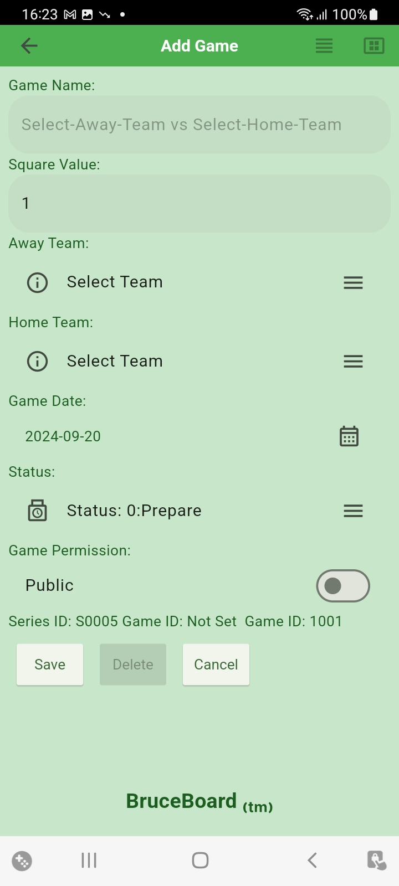

# User Manual - BruceBoard
## 1.0 Introduction
Version: 1.2.7 (30)

BruceBoard is an application used to Create, Maintain and Play standard 10x10 Sports Pools.
The key functionality includes the following:
+ Player Authentication allows users to create Player IDs, Signon and Signoff of the Application.
+ Create Communities to allow access to Pools.
+ Create Groups to organise Pools.
+ Create Pools to be played,
    + Allowing access to Communities.
    + Allowing public access to Pools.
    + Allow Players to select Squares.
    + Update Row/Column Digit Scores.
    + Update Quarterly Splits.
    + Update Quarterly Scores.
    + Distribute Credits to winners.
+ Respond to Messages from other Players.

**Note:** A Player can be given access to their own community to enable them to play along.

## 1.0 Home
The [Home] page is the launching point for the application. From here Players can:
+ Sign In / Sign Up
+ View Pools from Communities
+ View Public Pools
+ Manage Communities
+ Manage Groups and Pools
+ Manage Memberships
+ Manage Communities
+ Manage Messages
+ Manage Settings (Right on the App Bar '...')

### 1.1 Sign In
By Pressing the +Player icon on the [Home] page, players can sign in to their account.

To assist the player with entering the correct password, the [Eye] icon can be pressed to reveal the password.

If the user has forgotten their password, they can request a Password Reset by pressing the [Reset Password] button. This will send an email to the provided email address where they will be able to set a new password.

### 1.2 Sign Up
If the player does not already have a Player Account, they need to sign up for one by pressing the [Sign Up] button at the right of the App Bar.

When setting up a new Player Account a valid email address must be provided.

The passwords must be at least 6 charachters long.

The password must be entered the same twice to ensure the user has entered the password correctly.

The initials are automatically provided when the players [First Name] and [Last Name] are entered. This can be changed but should be kept short as this is used to indicate Squares assigned to the player.

Scroll down if needed to press the [Sign Up] button.

When the Player inforamtion is entered successfully, an email will be sent to the provided email address allowing the player to verify their email account.

### 1.3 Update Profile
Once the player account is created, the Player can update their profile information (First Name, Last Name, etc) via the [Update Profile] menu option from the [Home] screen.
From here the user can also see a summary of their Membership, Communities and Series.

All fields are required with the Display Name and Initials defaulting from the First Name and Last Name. These can be over written if desired.

#### 1.3.1 Email Verification
Players should only use valid emails as their Player ID to enable the full functionality of the BruceBoard App.

An verification email is set to the player when the account is first setup. If this is lost or unsuccessful, the player can initiate a new verificadtion email by pressing the [Verify Email] button.

Players can use the application without verifying their email but are not allowed to Request to Join any communities without verifying their email.

Owners can add non-verified Players to their communities but should be aware that the user may not have a valid email address.

If the Player's email has been verified, the [Verify Email] button will be disabled.

#### 1.3.2 Delete Account

Players can delete their account if desired. This will remove the Account from Firebase and the player will no longer have access to the Communities and/or Pools they are running.

The Player sign back up again but a new account will be provided and the Payer will need to re-request access to any communities they wish to join.  In addition, any communities or boards that they had will no longer be accessible.

### 1.4 My Communities
At the top of the [Home] page there are two tabs that allow the Player to view Pools accessed through 1. [My Communities] and 2. [Public Pools].

The Community Pools are organized by the Memberships that the Player has within different communities.

Communities are owner by Players and are given access to one or more of the owner's Groups that in turn, contain 1 or more Pools. Multiple Communities can access a single Group thus allowing a Player to have multiple Memberships with access to a Group and associated Pools.

The Player requests/receives credits for each membership which is displyed on the [Home] page beside the Membership ID.

On the [Home] page, the Groups that are accessible to each Membership the Player has are displayed on the page. Within each Group, the first couple of active Pools are displayed along with the number of active pools. The displayed Pools provide an indication of how many squares have been selected for the pools through the pie chart on the Pool card.

The Player can see all the active and complete pools within the Group by clicking on the [Double Chevron] icon for the Group.  This also allows users to access the Pool to select squares providing they have credits on their Membership

If the Player has a number of Memberships, they can scroll down the page to view them.

#### 1.4.1 List Pools
When the Player pressess the [Double Cheveron] icon, they will be taken to Pool List for the Group that will list all the Pools within the Group.

The Pool card shows the Pool name, data and Status of the Pool.

In addition, the [Ball] icon on the left of the card indicate the number of Squares that have been taken on the Pool board.

The [Ball] icon fill show the following square taken:
+ 0-25=Empty,
+ 26-50=1/4,
+ 51-75=1/2,
+ 76-99=3/4,
+ 100=Full

#### 1.4.2 View Pool

From the Pool List the Player can tap on the Pool Card to access the Pool.

The Pool Board Page shows the Pool with the Away team across the top and the Home team down the side.

When a square is available, it will have the Initials "FS" indicating it is a Free Square. The user can select any Free Square to request it.

Once a Square is Taken, the Players Initials will be displayed in the Square and it will be disabled.

While there are still squares left the number of remaining sqares will be visible in the top left corner of the board. In addition, the Scores for each Column and Row will be "?" indicating that they have not been assigned yet.

#### >> Scores Set / Winning Squares

Once the Board is full, the Owner of the board will set the scores. This is a process that radomly assigns a Digit between 0-9 to each of the Score Squares for the Away team (Horizontal) and Home team (Vertical).

When the Owner of the Pool enteres the quarterly scores, the winning square for each quarter is highlighted red, lighter to darker for each quarter.

#### 1.4.3 Pool Summary Page

The Player can view a summary of the Pool by pressing the [Pool Summary] button at the bottom of the Pool.

From the Summary Page, the Player can view the following:
+ The Scores entered for each quarter
+ The Winner of each quater
+ The number of Credits won
+ The credits that will be allocated to the Community
    + These can be due to rounding or included in the splits
+ The Total number of Credits to be distributed
+ The Percentages for each quater as well as the Community
+ The number of Squares each Players has Taken
+ The number of Free Squares

### 1.5 Public Pools
The [Public Pools] tab on the [Home] page displays all the Pools that have been given Public access by the Owners.

If the Player wishes to access the Pool, they need to request access to the Community from the Pool Owner and request Credits to play. See the Membership Section for details on selecting access to Owners Communities.

The Player may already have access to the Public pool, if so, the pool can be access through the [My Communities] tab.

### 1.6 About
The About Page can be accessed from the [Menu] on the [Home] page.

In addition to information about the BruceBoard app, the User Documentation can be access by clicking on the [Documentation] icon on the right of the App Bar.

### 1.7 Sign Out
When the Player is sign in to their account the [+Player] icon on the right of the App Bar changes to a [-Player] icon. The Player can sign out of their account by pressing the [-Player] icon.

## 2.0 Pool Management Icons
Along the bottom of the [Home] page there are 4 icons that provide access to key functionality.
1. Manage Messages (Players / Owners)
2. Manage Memberships (Pool Players)
3. Manage Communities (Pool Owners)
4. Manage Groups / Pools (Pool Owners)
### 2.1 Manage Messages (Pool Players)
Messages are managed on the Message Page. They are presented from oldest to newest to allow them to be addressed in the order they came in.
The following informtion is contained in the messages:
+ **From:** User the message was sent from.
+ **Type:** Type of Message. Each message has a message type to identify where it came from and what actions are possible (ie Accept and/or Reject)
+ **System Message:** System Generated message
+ **Sender Comment:** Comment added by the sender.
+ **Message Number:** The message number is on the last line of the message. This is a system generated number unique to the Sender.  Everytime the Player creates a message, their message number is increased. For each Player, message number start at 0 and increase by 1.
+ **Timestamp:** The time the message was sent can be found in the timestamp on the last line of the message.

Historical Messages can be views by clicking the [Message Folder] icon on the App Bar.

The [Wand] icon can be used to simplefy the management of message. Pressing it will Auto Process any messaeges that don't require a response. In order for this to work, the Player must set the Auto Processing status in on the [Settings] page.

**Note**: The System Message and Sender Comments are indentified by the line prompt '>'.

**Note**: One of the most important messages to respond to is the "Add Member Notification" as this update the Players Membership record to "Approved" allowing them to access Pools.

### 2.2 Manage Memberships (Pool Players)
Players have memberships within other Player Communities that have access to the Community Owner's Groups of Pools.

Players can review their Memberships by pressing the [Memberships] icon on the [Home] page.

From here, they are able to complete the following:
+ Request their Membership be deleted.
+ Request Additional Credits for a Membership
+ Request Removing of Credtis from a Membership
+ Request Membership in another Player's community

#### >> Request to be Removed from Community

The Player can also request to be remvoed from a Community by pressing the [Trash] icon on the desired Membership card.

#### >> Request to Add/Remove Credits

Additional credits within the membership can be requested by pressing the [Bank] icon on the Membership card. Credit removal can be requested through the same process.

**Note**: It is possible to have Memberships within multiple Communities that have access to the same Pool. When Accessing Pools, ensure you are accessing them from the desired Membership Box on the [MyCommunities] tab on the [Home] page.

#### >> Request Membership in another Player's Community
By pressing the [Plus] icon on the right of App Bar, the Player can request access to another Players communities.  The [Select Player] button is used to select the Owner of the Community the Player wants to join. This will display the Communities owned by the selected Player.

Select the Community to request membership.

Once approved, the requesting Player must review their messages to accept the Membership. After the Membership is accepted, the status will change from "Requested" to "Approved".

**Note**: In the list of Memberships, a status of "Requested" indicates that your memberhsip request has not been accepted by the community owner yet or that the Player has not responded to the required Notification.

### 2.3 Manage Commmunities (Pool Onwers)
Communities are collections of Players that are provided access to specific Groups thus allowing access to the Pools within the Group to the Members in the Community.

The [Pencil] icon on the Community card can be used to edit the Community details such as Community Name.

#### 2.3.1 Maintain Community Members
Tap on the Community card to display a list of Members within the Community.

Players can be added to the Community by tapping the [Plus] icon on the App Bar.  From here, the list can be filtered and the desired player can be selected.

When a Player is added to the Community, a Message will be sent to the Player and the added Player must Acknowledge the Membership in order to see Pools that the Community has access to.

**Recommendation**: Add "Excluded Player" (1000) to the Community to be used to Exclude squares from a Pool. This is used when a full board isn't filled and the Owner wishes to exclude the unselected squares. These squares will not be included in the Total Credits for the Pool and will impact the number of Credits distributed from the Pool.

**Recommendation**: Add the Pool Owner as a member of the Community as this is where any distributed credits for the Community will be assigned.

#### >> Update / Delete Members

The Credits can be updated by editing the Member record. Member will be notified of the addition to the Community.

### 2.4 Manage Groups / Pools (Pool Owner)
This icon allows Owners to manage Groups and the Pools within the groups.

#### 2.4.1 Manage Groups
Groups are collections of Pools. This can be any grouping of Pools the Owner wants (i.e. Pools for a given week, Pools for a given team, Pools for a given playoff series, etc).

The Groups that the Player can see can be access through the [Create Groups & Manage Pools] button on the [Home] screen for Owners of the Groups or through the [Join Communities & Play Pools] button on the [Home] screen for Players which have been provided access through their community memberships.

Groups are owned and managed by the Player that created them (the Owner). The list of Groups owned by the active player is accessed by the [CreateGroups & Manage Pools] button on the [Home] screen.

From this list the Player can do the following:
+ View the Name and Status for a Group
+ Add new Groups by pressing [+] icon on the App Bar
+ Edit existing Groups by pressing [Pencil] icon on the Group card
+ Add Pool to the group by pressing anywhere on the Group card. This will take the Player to the [Pool List] screen for the Group

### 2.4.1.1 Maintain Group
By pressing the [Pencil] Icon on a Group, the Player opens the [Edit Group] screen where they can update the Type, Name, Status, manage Access to the Group and Delete the Group.

The Default community is the community that will be selected when Players requests access to a Pool from the [Public Pools] tab.

The Status is used to determine what Groups are included to present to users. Only "Active" Groups are presented to Players throught their Memberships.

**Note**: The Owner must be a member of the Default Community if any credits will be distributed to the Community as a result of rounding or allocating a percent split to the Community as this is where the credits will be distributed to.

#### >> Type Field Dropdown

The Type field is a drop down menu that allows the Owner to select the League for all the Pools defined for the Group.

If the Pools are not associated with a known league (NFL, NBA, CFL) then the Player can select [Other] menu option to allow the entry of text values for the Home and Away teams for Pools within the Group.

### 2.4.1.2 Delete Group
The Group can be delete from the Access list by pressing the [Delete] button.

**Note** In order to delete the Group, all Pools and Accesses must be removed.

### 2.4.1.3 Manage Community Access to Group
The [Access] button is used to determine what Communities have access to the Group through the [Manage Access] screen.

Players within the Communities that are include in the Access list will be able to see the Pools within the Group and be able to Request Squares to play.

Owner can add Access to the Group by adding Communities to the list.  This is done by prssing the [+] sign in the App Bar at the top right part of the screen.

Owners can also delete Access to the Group by deleting the Community from the list.  This is done by pressing the [Garbage Can] icon on the associated card for the Community.

**Note:** This will not change any squares Players wihtin the Community have already requested.

How to add/removing individual Players to/from the Community is described the Community Section below.

## 2.4.2 Manage Pools
Pools are created within a specific Group through the [Manage Groups] screen.

To access the [Manage Pool] screen from the [Manage Group] screen, tap on the Group card from the List.

From the [Manage Pools] screen, the Owner can Add, Edit and Delete Pools from the Group.

### 2.4.2.1 Add Pools

To add a new Pools to the Group, press the [+] icon in the top right on the App Bar. This will open the [Add Pool] screen and allow the Owner to update the Square Value, Home/Away teams, Pool Date and Status.

If the Group Type is a known League (NFL, NBA, CFL, etc) then the Owner is able to select the Home / Away from a Dropdown list of the teams within the League.

The Pool Status values can be one of the following:
+ **Prep:** Pool is in a prep stage and Players will not be able to see it.
+ **Active:** Pool is currently acive and ready for Players.
+ **Complete:** Pool is complete and credits have been distributed.
+ **Archive:** Pool is arcived and no longer visible to Players.

Once the data is completed, the Owner presses [Save] button to save the team in the list.

The Status is used to determine what Pools are included to present to users. Only "Active" Pools are presented in the [Public Pools] tab.
Only "Active" Pools are presented to Players throught their Memberships.

### 2.4.2.2 Edit Pools
The Owner can change the attributes of the Pool after it is created by pressing the [Pencil] icon on the Pool card.

This will go to the [Edit Pool] screen which contains the same info as the [Add Pool] screen.

If the [Cancel] button or [Back Arrow] are pressed, changes are not saved to the Database.

#### 2.4.2.3 Delete Pool
Pools can be deleted through the [Edit Pool] screen by pressing the [Delete] button.

### 2.4.3 Pool Board

The Pool Board is where the Owner manages the active Pool. Here the owner can complete the following:
+ **Assign Squares Individual:** Click on desire square and select Player from the desired community. Only Communities that have access to the series are shown in the selection list. Only Players that have a balance above 0 or the Excluded Player are selectable.
+ **Fill Squares Remaining:** Select Menus option and select Player to assign to the remaining squares. Squares will be assigned to the Player selected until the player has run out of credits.  If you want to exclude squares from the Pool (ie credits are not included in the totals), include the "Exclude Player" (1000) in the Community select it to exclude the remaining squares.
+ **Set the Row/Column numbers:** Press the Green [Lock] icon available when the Board is full. Once this is pressed, the [Lock] icon will turn Red and not be accessible.
**Note**: Once the Row/Column numbers have been set, the Splits can no longer be adjusted.

Players are able to View and Request Squares from the Pool board as well. If the Owner has set the "Square Request" in their Auto Processing settings, requested squares are processed automatically if the Player has enough credits. If the "Square Requested" Auto Processing is not set, the Square will be set to "Requested" (Amber) and is not processed until the owner reviews and accepts the Message request. At this point, credits will be debited and the Square will be moved to "Taken".
If the owner "Rejects" a players Request, the Square is return to "Free" at which time, other players may Request the square.

### 2.4.3.1 Pool Board Summary
The Pool summary can be access by pressing the [Pool Summary] button on the Pool page.

From here the Owner can comlete the following:
+ **Set Scores:** Press the [Score] button beside the quarter to set the score.
+ **Update Splits:** Select Menu Option and enter desire splits. This option is disabled once the Scores are locked.
+ **Distribute Credits:** When the Pool is complete and all Scores have been entereed, the Owner can Distribute the

#### >> Pool Board Winners

When the Owner of the Pool enteres the quarterly scores, the winning square for each quarter is highlighted red, lighter to darker for each quarter.

## 9.0 Technical Information
The following are key data model elements used within the BruceBoard Application.
+ Player : Holds all data for the Player (ie Series, Memberships, Communities)
+ Memberships : Players Memberships in Communities.
+ Groups: Collections of Pools.
+ Pools : Pool Data including Squares, Scores and Splits.
+ Community : Collections of Players assigned access to Groups of Pools.
+ Messages : List of Messages from other Players.

The BruceBoard app is built on the Firebase datastore.Firebase is a service provided by Google and provides Authentication and Data capabilities.

### 9.1 Authentication
BruceBoard uses Firebase to manage Application Authentication. Firebase Authentication contains key information such as:
+ Login Email Name / Password
+ Display Name
+ Firestore UserID

This data (except Password) is available to the Addministration Account to manage users (delete, disable, password reset)

Firebase Authentication is provied by Google and is secure, allowing Players to authenticate via a number of methods (ie email/password, facebook, etc).  Currently, only email/password has been enabled.

### 9.2 Player
Players are stored in the database and are accessible by all users of the application.

Players (as an Owner) can manages Communities, Groups, Pools etc, as well as joining other Players (as a Player) Pools.

Player Data consists of basic Personal Data such as:
+ First Name, Last Name
+ Initials
+ Display Name
+ Player Number

