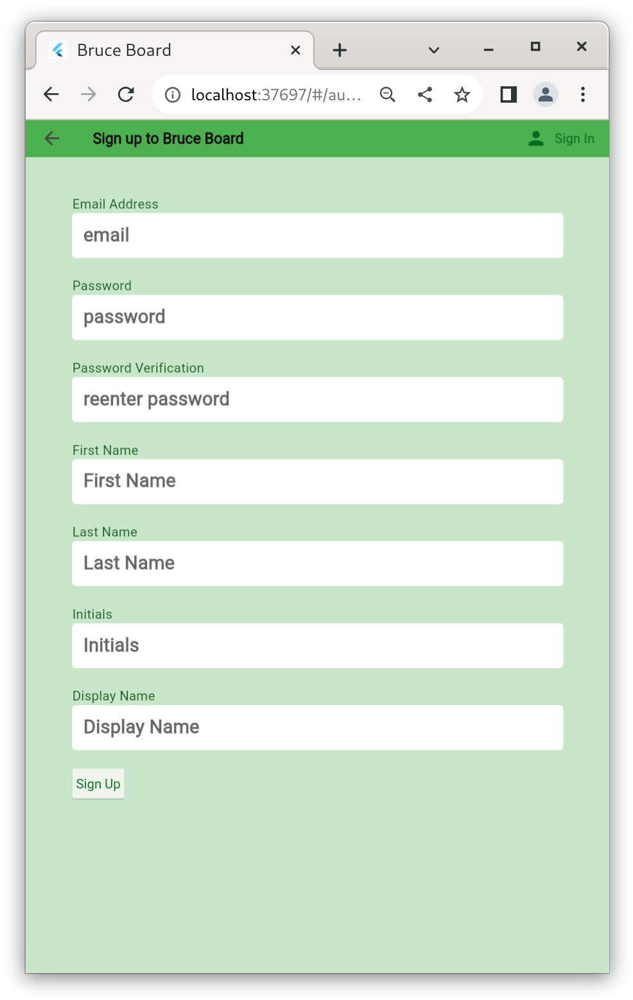
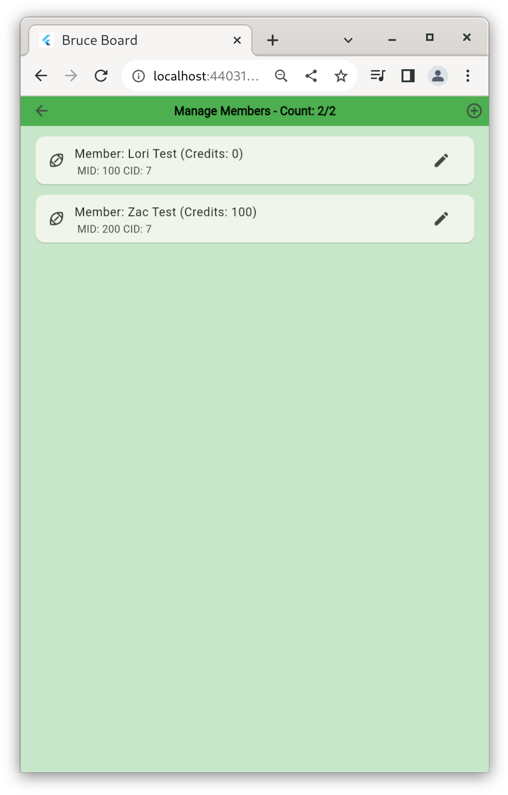
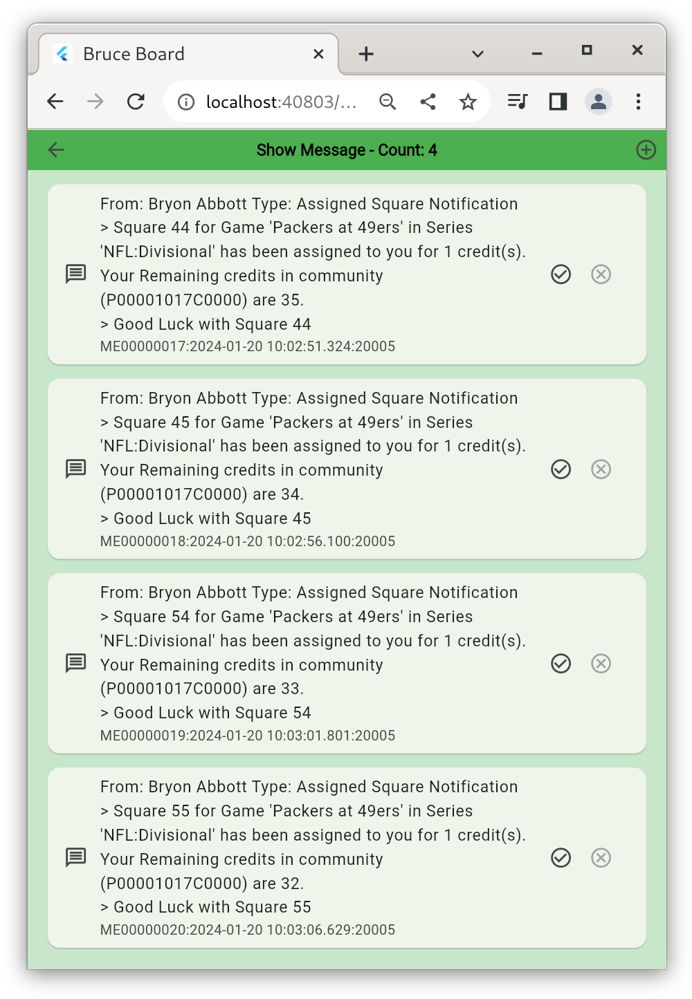

# User Manual - BruceBoard
Version: 1.0.01

BruceBoard is an application used to Create, Maintain and Play standard 10x10 Football Pools. 
The key functionality includes the following: 
+ Player Authentication allows users to create Player IDs, Signon and Signoff of the Application. 
+ Create Communities to allow access to Games. 
+ Create Series to organise Games.
+ Create Games to be played, 
    + Allowing access to Communities.
    + Allow Players to select Squares.
    + Update Row/Column Digit Scores.
    + Update Quarterly Splits.
    + Update Quarterly Scores.
    + Distribute Credits to winners. 
+ Respond to Messages from other Players. 

**Note:** A Player can be given access to their own community to enable them to play along. 

## 1.0 Data Model 
The following are key data model elements used within the BruceBoard Application. 
+ Player : Holds all data for the Player (ie Series, Memberships, Communities)
+ Memberships : Players Memberships in Communities. 
+ Series: Collections of Games.
    + Games : Game Data including Squares, Scores and Splits.
+ Community : Collections of Players assigned access to Series of Games.
+ Messages : List of Messages from other Players. 

Firebase is a service provided by google and provides Authentication and Data services.

## 2.0 Home 
The Home pages is the launching point for the application. From here Players can: 
+ Manage Communities
+ Mange Series and Games 
+ Manage Memberships in Communities
+ Manage Messages 
+ Sign On / Sign Up
+ Manage Settings via the Home Screen menue (Top Left '...')

### 2.1 Authentication 
BruceBoard uses Firebase to manage Application Authentication. Firebase Authentication contains key information such as: 
+ Login Email Name / Password
+ Display Name
+ Firestore UserID

This data (except Password) is available to the Addministration Account to manage users (delete, disable, password reset)

Firebase Authentication is provied by Google and is secure allowing Players to authenticate via a number of methods (ie email/password, facebook, etc).  Currently, only email/password has been enabled. 

### 2.2 Player
Players are stored in the database and are accessible by all users of the application. 

Players (Owner) can manages Communities, Series, Games etc as well as joining other Players(Player) games.

Player Data consists of basic Personal Data such as: 
+ First Name, Last Name
+ Initials

#### 2.2.1 Sign In
Users can Sign Up and Sign In using the Sign-In button on the Home Page. 

If the user already has an id, they can use it to sign in otherwise they need to Sign Up using the button on the right of the App Bar. 

#### 2.2.2 Sign Up
To sign up to use BruceBoard, click on the Sign-Up icon in the top left and enter your email and password. This will create an account that will be used to manage all functionality. 

#### 2.2.3 Update Profile
Once the account is created, the Player can udpate their Profile information (First Name, Last Name, etc) via the Update profile menu option from the Home page. 
From here the user can also see a summary of their Membership, Communities and Series. 

All fields are required with the Display Name and Initials defaulting from the First Name and Last Name. These can be over written if desired. 

## 3.0 Series 
Series are collections of games. This can be a weekly collection or a collection of futures games for a team. 

### 3.1 Series List 
Series are owned and managed by the Player that created them. The list of series owned by the active player is accessed by the Series button on the Home Screen.

From this list the Player can do the following: 
+ Add new series (Press + on the AppBar)
+ Edit existing series (change name, change access)

### 3.2 Series Maintain
By tapping a Series, the Player is taken to the Edit Series Screen where they can update the Series Name, Type and Access

The Access button is used to maintain what Communities have access to this Series.

### 3.3 Manage Community Access
Manage the Communities that have access to this Series. Here you can and/delete access but this will not change any squares players wihtin the community have purchased. 

Adding and removing Players is handing under the Community Section. 

### Games
Access the Games witin the Series by tapping on the Series Tile in the Series List. 
From here the Game can be edited or the Board can be viewed. 

When a game is added or edited, basic information about the Game is captured includeing: 
+ Game Name
+ Square Values (How many credits are take for each square)
+ Team Names. 
Games may also be Deleted from here. 

The Game Board is where the Owner manages the active game. Here the owner can complete the following: 
+ Assign Squares Individual : Click on desire square and select user. 
+ Assign Squares Remaining : Select Menus option and select user. 
+ Set Splits : Select Menu Option and enter desire splits. 
+ Set Scores : Select Score button beside desire quarter. 
+ Set the Row/Column numbers : Press the Lock Icon available when the Board is full.

Players are able to View and Request Squares. The Square is not assigned until the Owner reviews and accepts the request. At this point the Square will be assigned and other users will not be able to select that square. 

### Communities
Communities are collections of Players that are provided access to specific Series. 

Members can be added or deleted from the Members List.  The Credits can be updated by editing the Member record. Member will be notified of the addition to the Community.

### Memberships / Members
Players can request to be a Member of a Community by selecting the add membership plus icon in the header. From here, the Player can Communities by other players.

In the list of memberships, a -1 in the credits indicates that your memberhsip request has not been accepted by the community owner yet. 

### Messages
Messages are manaaged thru the Message screen. 

