# User Manual - BruceBoard
## 0.0 Introduction 
Version: 1.1.6 (19)

BruceBoard is an application used to Create, Maintain and Play standard 10x10 Sports Pools. 
The key functionality includes the following: 
+ Player Authentication allows users to create Player IDs, Signon and Signoff of the Application. 
+ Create Communities to allow access to Games. 
+ Create Groups to organise Games.
+ Create Games to be played, 
    + Allowing access to Communities.
    + Allow Players to select Squares.
    + Update Row/Column Digit Scores.
    + Update Quarterly Splits.
    + Update Quarterly Scores.
    + Distribute Credits to winners. 
+ Respond to Messages from other Players. 

**Note:** A Player can be given access to their own community to enable them to play along. 

## 1.0 Data Model 
The following are key data model elements used within the BruceBoard Application. 
+ Player : Holds all data for the Player (ie Series, Memberships, Communities)
+ Memberships : Players Memberships in Communities. 
+ Groups: Collections of Games.
+ Games : Game Data including Squares, Scores and Splits.
+ Community : Collections of Players assigned access to Groups of Games.
+ Messages : List of Messages from other Players. 

The BruceBoard app is built on the Firebase datastore.Firebase is a service provided by Google and provides Authentication and Data capabilities.

## 2.0 Home 
The Home pages is the launching point for the application. From here Players can: 
+ Manage Communities
+ Manage Groups and Games 
+ Manage Memberships in Communities
+ Manage Messages 
+ Sign On / Sign Up
+ Manage Settings via the Home Screen menue (Top Left '...')

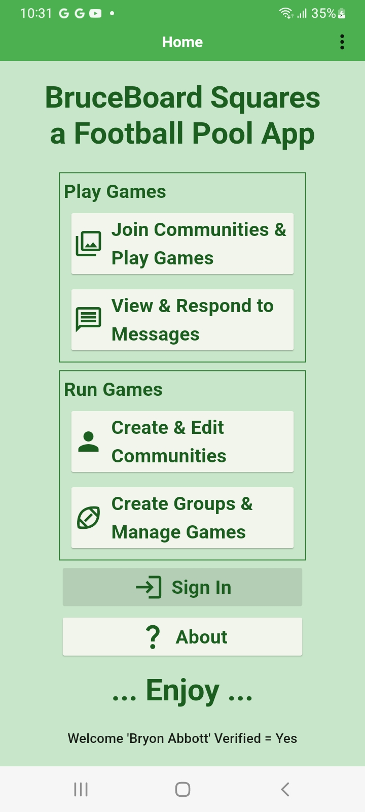

### 2.1 Authentication 
BruceBoard uses Firebase to manage Application Authentication. Firebase Authentication contains key information such as: 
+ Login Email Name / Password
+ Display Name
+ Firestore UserID

This data (except Password) is available to the Addministration Account to manage users (delete, disable, password reset)

Firebase Authentication is provied by Google and is secure, allowing Players to authenticate via a number of methods (ie email/password, facebook, etc).  Currently, only email/password has been enabled. 

### 2.2 Player
Players are stored in the database and are accessible by all users of the application. 

Players (as an Owner) can manages Communities, Groups, Games etc as well as joining other Players(as a Player) games.

Player Data consists of basic Personal Data such as: 
+ First Name, Last Name
+ Initials
+ Display Name
+ Player Number

#### 2.2.1 Sign In
Users can Sign Up and Sign In using the [Sign In] button on the Home Page. 

If the user already has an Player ID, they can use it to sign in, otherwise they need to Sign Up by pressing the [Sign Up] button on the top right of the App Bar. 

If the user has forgotten their password, they can request a Password Reset by pressing the [Reset Password] button. This will send an email to the provided email address where they will be able to set a new password.

Emails must be at least 6 charachters long. 

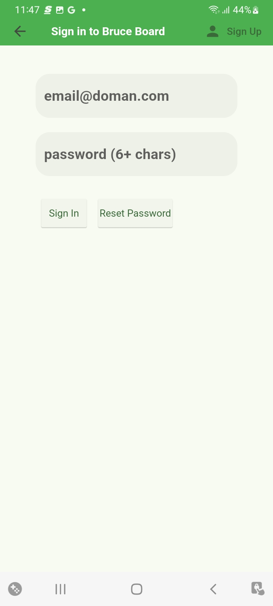

#### 2.2.2 Sign Up
To sign up to use BruceBoard, click on the [Sign Up] icon in the top left and enter your email, password (2x) and additional informatino. This will create an account that will be used to both play other's games or set up your one. 

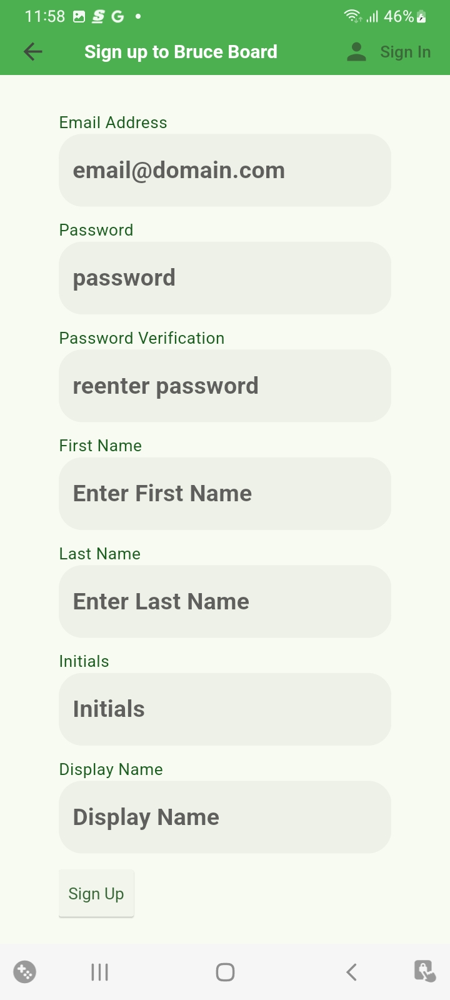

**Note:** The password must be entered the same twice to ensure the user has entered the password correctly. 

#### 2.2.3 Update Profile
Once the account is created, the Player can update their profile information (First Name, Last Name, etc) via the [Update Profile] menu option from the [Home] screen. 
From here the user can also see a summary of their Membership, Communities and Series. 

All fields are required with the Display Name and Initials defaulting from the First Name and Last Name. These can be over written if desired. 

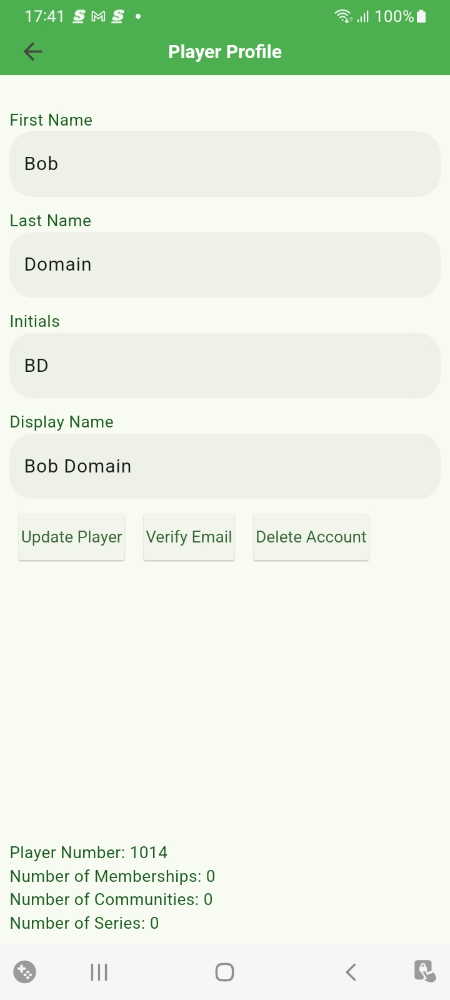

#### 2.2.3 Email Verification 

Players should only use valid emails as their logon ID to enable the full functionality of the Bruce Board App. 

Players can use the application without verifying their email but are not allowed to Request to Join any communities without verifying their email. 

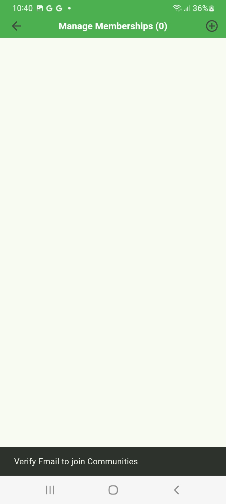

Owners can add non-verified Players to their communities but should be aware that the user may not have a valid email address.

If the Player's email has been verified, the [Verify Email] button will be disabled. 

#### 2.2.4 Delete Account 

Players can delete their account if desired. This will remove the Account from Firebase and the player will no longer have access to the Communities and/or Gamess they are running. 

The Player sign back up again but a new account will be provided and the Payer will need to re-request access to any communities they wish to join.  In addition, any communities or boards that they had will no longer be accessible.  

## 3.0 Groups 
Groups are collections of games. This can be any grouping of games the Owner wants (i.e. games for a given week, games for a given team, games for a given playoff series, etc). 

The Groups that the Player can see can be access through the [Create Groups & Manage Games] button on the [Home] screen for Owners of the Groups or through the [Join Communities & Play Games] button on the [Home] screen for Players which have been provided access through their community memberships. 

### 3.1 Manage Groups (Owner)
Groups are owned and managed by the Player that created them (the Owner). The list of Groups owned by the active player is accessed by the [CreateGroups & Manage Games] button on the [Home] screen.

From this list the Player can do the following: 
+ Add new Groups by pressing [+] icon on the App Bar
+ Edit existing Groups by pressing [pencil] icon on the Group tile.
+ Add Games to the group but pressing anywhere on the Group tile. This will take the Player to the [Game List] screen for the Group.

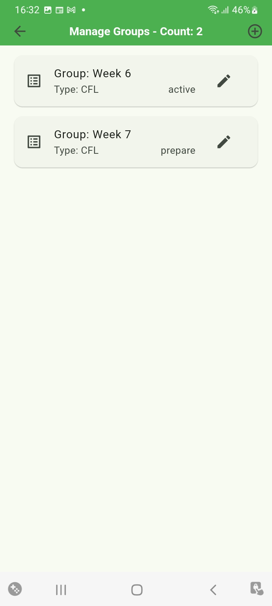

### 3.2 Maintain Group
By pressing the [Pencil] Icon on a Group, the Player opens the [Edit Group] screen where they can update the Type, Name, Status, manage Access to the Group and Delete the Group.

The Type field is a drop down menu that allows the Owner to select the League for all the Games defined for the Group. 

If the Games are not associated with a known league (NFL, NBA, CFL) then the Player can select [Other] menu option to allow the entry of text values for the Home and Away teams for Games within the Group. 

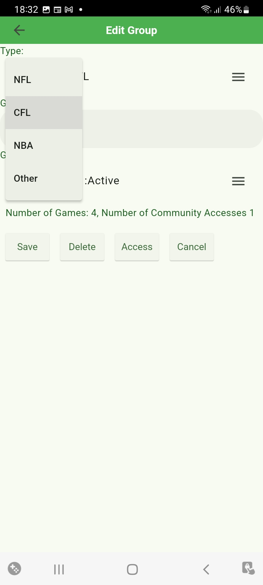

### 3.3 Delete Group
The Group can be delete from the Access list by pressing the [Delete] button. 

**Note** In order to delete the Group, all Games and Accesses must be removed.

### 3.4 Manage Community Access to Group
The [Access] button is used to determine what Communities have access to the Group through the [Manage Access] screen.

Players within the Communities that are include in the Access list will be able to see the Games within the Group and be able to Request Squares to play.

Owner can add Access to the Group by adding Communities to the list.  This is done by prssing the [+] sign in the App Bar at the top right part of the screen.

Owners can also delete Access to the Group by deleting the Community from the list.  This is done by pressing the [Garbage Can] icon on the associated tile for the Community.

**Note:** This will not change any squares Players wihtin the Community have already requested. 

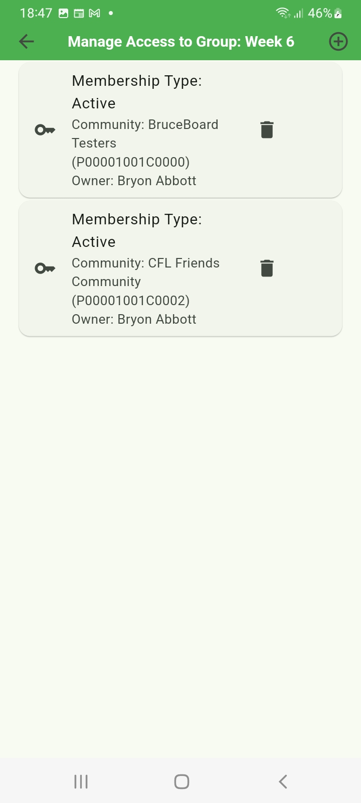

How to add/removing individual Players to/from the Community is described the Community Section below. 

## 4.0 Games
Games are created within a specific Group through the [Manage Groups] screen.

To access the [Manage Games] screen from the [Manage Group] screen, tap on the Group tile from the List. 

From the [Manage Games] screen, the Owner can Add, Edit and Delete Games from the Group.

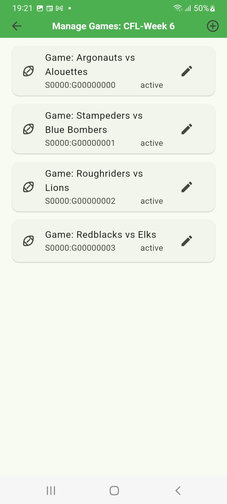

### 4.1 Add Games 

To add a new Game to the Group, press the [+] icon in the top right on the App Bar. This will open the [Add  Game] screen and allow the Owner to update the Square Value, Home/Away teams, Game Date and Status. 

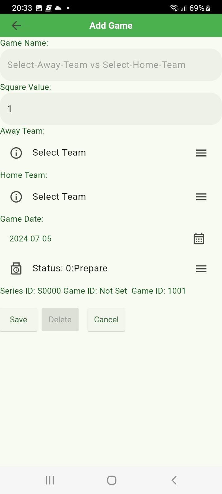

If the Group Type is a known League (NFL, NBA, CFL, etc) then the Owner is able to select the Home / Away from a Dropdown list of the teams within the League. 

The Game Status values can be one of the following: 
+ **Prep:** Game is in a prep stage and Players will not be able to see it.
+ **Active:** Game is currently acive and ready for Players.
+ **Complete:** Game is complete and credits have been distributed.
+ **Archive:** Game is arcived and no longer visible to Players.

Once the data is completed, the Owner presses [Save] button to save the team in the list. 

### 4.2 Edit Games 
The Owner can change the attributes of the Game after it is created by pressing the [pencil] icon on the Game tile. 

This will go to the [Edit Game] screen which contains the same info as the [Add Game] screen.

If the [Cancel] button or [Back Arrow] are pressed, changes are not saved to the Database. 

#### 4.3 Delete Games
Games can be deleted through the [Edit Game] screen by pressing the [Delete] button.

### 5.0 Game Board 

The Game Board is where the Owner manages the active game. Here the owner can complete the following: 
+ **Assign Squares Individual:** Click on desire square and select Player from the desired community. Only Communities that have access to the series are shown in the selection list. Only Players that have a balance above 0 or the Excluded Player are selectable.   
+ **Assign Squares Remaining:** Select Menus option and select Player to assign to the remaining squares. Squares will be assigned to the Player selected until the player has run out of credits.  If you want to exclude squares from the game (ie credits are not included in the totals), include the desired "Exclude" Player to the community and set the Exclude Player in the settings. When this player is selected, the associates squares are excluded from the totals. 
+ **Set Splits:** Select Menu Option and enter desire splits. This option is disabled once the Scores are locked.
+ **Set Scores:** Select Score button beside desire quarter. 
+ **Set the Row/Column numbers:** Press the Lock Icon available when the Board is full.

Players are able to View and Request Squares. The Square is not assigned until the Owner reviews and accepts the Message request. At this point the Square will be assigned and other users will not be able to select that square. 

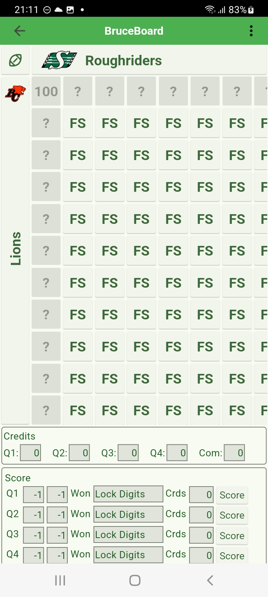

### 6.0 Communities
Communities are collections of Players that are provided access to specific Series. 

Members can be added or deleted from the Members List.  The Credits can be updated by editing the Member record. Member will be notified of the addition to the Community.

### 7.0 Memberships / Members
Players can request to be a Member of a Community by selecting the add membership plus icon in the header. From here, the Player can Communities by other players.

In the list of memberships, a -1 in the credits indicates that your memberhsip request has not been accepted by the community owner yet. 

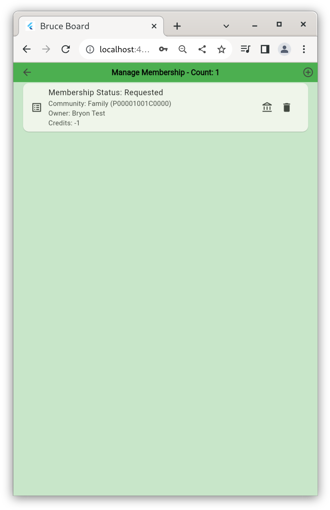

### 8.0 Messages
Messages are managed on the Message screen. They are presented from oldest to newest to allow them to be addressed in the order they came in.   
The following informtion is contained in the messages:  
+ **From:** User the message was sent from.  
+ **Type:** Type of Message. Each message has a message type to identify where it came from and what actions are possible (ie Accept and/or Reject)  
+ **System Message:** System Generated message   
+ **Sender Comment:** Comment added by the sender.  
+ **Message Number:** The message number is on the last line of the message. This is a system generated number unique to the Sender.  Everytime the Player creates a message, their message number is increased. For each Player, message number start at 0 and increase by 1.  
+ **Timestamp:** The time the message was sent can be found in the timestamp on the last line of the message. 

**Note**: The System Message and Sender Comments are indentified by the line prompt '>'.

